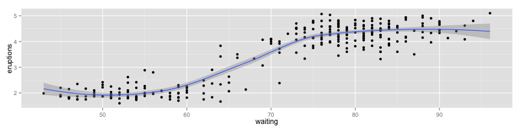
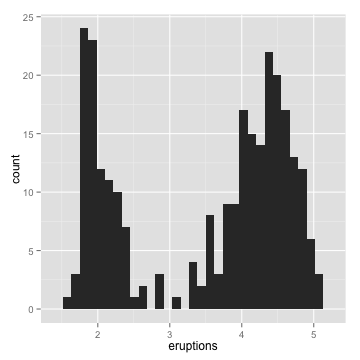

# Tufte Handouts in rmarkdown
Michael Sachs  
June 25, 2014  

<style type = "text/css">
header {

width: 160px;
position: fixed;
float: left;
margin-left: -160px;

}
</style>

<header>
<a href="http://github.com/sachsmc/tufterhandout">View on github</a>
</header>


# Introduction

This is an R Markdown document. Markdown is a simple formatting syntax for authoring HTML, PDF, and MS Word documents. This package provides output formats to create "Tufte-style" handouts. 

<aside>For more details on using R Markdown see <http://rmarkdown.rstudio.com>.</aside> 

Tufte-style handouts make heavy use of the right margin. Our package provides templates for creating these types of documents in pdf or html format. The pdf format uses the tufte-handout document class.

<aside>Credit: <http://code.google.com/p/tufte-latex/></aside>

The html format uses bootstrap with some css to put stuff in the margin. Each uses knitr hooks to specify the types of figures. There is also a pdf version of this document.

<aside> Check out the <a href="pindex.pdf">pdf version</a>!</aside>

# Usage

To create sidenotes in html, some raw html is required. We make use of the `aside` tag. Place the sidenote content between the tags `<aside></aside>` to place them in the sidebar. In the pdf version, simply use the pandoc footnote format `^[Content]`. Anything can be enclosed in the `aside` tag, even code!

<aside>

```r
rnorm(1)
```

```
## [1] 0.08815
```
</aside>

The package provides two custom hooks for figure placement. The first is `marginfigure`. Set `marginfigure = TRUE` in a chuck option to place a figure in the right margin. Optionally, specify the figure size and include a caption. Captions are passed as strings through `fig.cap` in the chunk options.


```r
library(ggplot2)
ggplot(mtcars, aes(y = mpg, x = wt)) + geom_point() + stat_smooth(method = "lm")
```

<aside style="margin-top:-6em"> <p class="caption">This is a marginfigure</p></aside>

The html documents have the body set at a fixed width of 960px. Feel free to edit the css to suit your needs. Html output supports any of the built in Bootstrap themes. Be careful using the fluid grid system, it may break the output for narrow screens. 

The second custom hook is `fig.star`. Setting `fig.star = TRUE` creates a full-width figure spanning the main body and the margin. The caption goes in the sidebar under the figure. These look pretty sweet!  Specify the width and height for best results. 


```r
ggplot(faithful, aes(y = eruptions, x = waiting)) + geom_point() + stat_smooth(method = "loess")
```

<div class="fullwidth"> <aside style="margin-top: 0em"><p class="caption">Full-width figure</p><aside></div>

Finally, normal figures are plotted in the main body, with the captions in the margin. The only option necessary here is the caption itself.


```r
ggplot(faithful, aes(x = eruptions)) + geom_histogram(binwidth = 0.1)
```

<p> <aside><p class="caption">Normal figure with caption in the margin</p></aside></p>

# Resources

### Check out the pdf version of this document: <a href="pindex.pdf">PDF version</a>

### Learn more about rmarkdown: <http://rmarkdown.rstudio.com>


